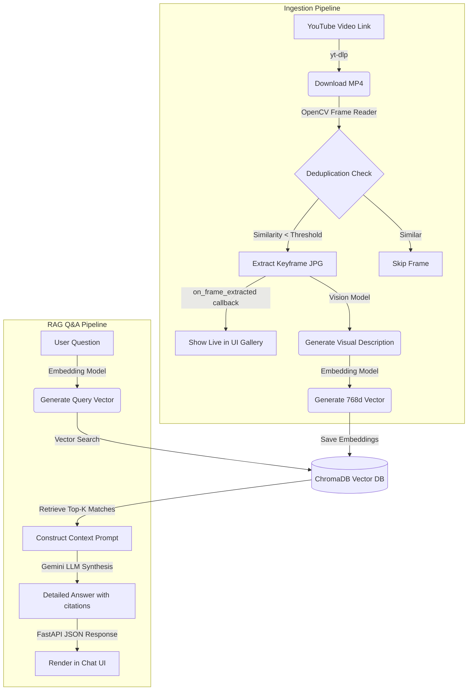

# 🎥 Video RAG: Multi-Modal Video Question Answering Dashboard

Video RAG is a premium, real-time Single-Page Dashboard application that allows you to download YouTube videos, extract keyframes, generate brief visual descriptions, index them in a vector database, and query the video content using Gemini or local Ollama LLMs.

The pipeline is designed to support **real-time extraction preview**, **pause and resume control**, and **instant Q&A querying on partial subsets** as soon as they are indexed.

---

## 🚀 Quick Start (Docker)

The fastest way to run Video RAG — pull the pre-built image and start in under 2 minutes.

### Prerequisites
- [Docker Desktop](https://www.docker.com/products/docker-desktop/) installed and running
- [Ollama](https://ollama.com/download) installed on your machine

### 1. Pull and start the required Ollama models

```bash
ollama pull qwen2.5vl:3b
ollama pull nomic-embed-text
```

### 2. Run the app

```bash
docker run -d -p 8000:8000 \
  -v $(pwd)/frames:/app/frames \
  -v $(pwd)/videos:/app/videos \
  -e OLLAMA_HOST=http://host.docker.internal:11434 \
  --name video-rag-app \
  himanshu337/video-rag:latest
```

> **Windows PowerShell users:** Replace `$(pwd)` with `${PWD}`:
> ```powershell
> docker run -d -p 8000:8000 `
>   -v ${PWD}/frames:/app/frames `
>   -v ${PWD}/videos:/app/videos `
>   -e OLLAMA_HOST=http://host.docker.internal:11434 `
>   --name video-rag-app `
>   himanshu337/video-rag:latest
> ```

### 3. Open the dashboard

Visit **[http://localhost:8000](http://localhost:8000)** in your browser.

### 4. Using Gemini instead of Ollama

You can also use **Google Gemini** instead of Ollama. Simply click the ⚙️ settings icon in the dashboard, switch the provider to **Gemini**, and paste your API key from [Google AI Studio](https://aistudio.google.com/apikey).

---

## 🌟 Key Features

* **Multi-Threaded Control Loop**: Run ingestion in the background with the ability to **Pause** extraction mid-run, automatically wrap up and index what was extracted so far, and **Resume** later without losing deduplication history.
* **Smart Keyframe Deduplication**: Evaluates structural changes using HSV Color Histograms to keep only distinct visual scenes (max 10 keyframes per session to save token usage and database space).
* **Flexible Multi-Provider Setup**:
  * **Cloud Mode**: Gemini Vision (`gemini-2.5-flash`) for description generation and Gemini Embeddings (`gemini-embedding-2`) for indexing.
  * **Local Mode**: Ollama Vision (`qwen2.5vl:3b`) for descriptions and local embeddings (`nomic-embed-text`).
* **Real-time Live Gallery**: Watch keyframes render on your dashboard seconds after they are written to disk.
* **Subset Q&A Querying**: Instantly query indexed keyframes at any stage. You can ask questions even while the extraction is paused.
* **Premium Glassmorphic UI**: Beautiful dashboard styling with dark mode, interactive overlays, live status animations, and standard image modal overlays.

---

## 🛠️ Architecture Workflow



---

## 📁 Repository Structure

```
video-rag/
├── config.py             # Global variables (Thresholds, Providers, Model Settings)
├── main_web.py           # FastAPI Web Server, Control Routes, State Management
├── index.html            # Frontend Dashboard (HTML5, Vanilla CSS, JS Event Loops)
├── Dockerfile            # Docker container configuration
├── ingest/
│   ├── download.py       # yt-dlp downloader, OpenCV frame extraction & histogram comparison
│   ├── describe.py       # Vision API connectors (Gemini / Ollama)
│   ├── embedding.py      # Embedding generation (Gemini / Ollama)
│   └── ingest.py         # Main pipeline coordinator
├── query/
│   └── query.py          # Vector query resolver, Gemini Q&A Prompt Constructor
├── pyproject.toml        # Dependency configurations
└── .env                  # API keys and local environment setups
```

---

## ⚙️ Manual Setup (Without Docker)

If you prefer running without Docker:

### 1. Prerequisites
* **Python 3.10 - 3.12**
* **Ollama** (if running models locally): [Download Ollama](https://ollama.com/)
  ```bash
  ollama pull qwen2.5vl:3b
  ollama pull nomic-embed-text
  ```
* **Gemini API Key** (if running in cloud mode): Get it from [Google AI Studio](https://aistudio.google.com/apikey).

### 2. Install Dependencies

```bash
# Clone the repository
git clone https://github.com/himanshuz-bharti/video-rag.git
cd video-rag

# Setup virtual environment and install packages
uv venv
uv pip install -r pyproject.toml
```

### 3. Environment Setup
Create a `.env` file in the project root:

```env
GEMINI_API_KEY=your_gemini_api_key_here
```

### 4. Run the Dashboard
```bash
uv run python main_web.py
```
Open **[http://127.0.0.1:8000](http://127.0.0.1:8000)** in your browser.

---

## 🎯 How to Use

1. **Paste a YouTube URL** → click **Process Video**.
2. Keyframes will immediately render in the **Extracted Frames Preview** gallery as they are processed.
3. Click **Pause** mid-extraction to halt extraction. Status will update to `indexing` as it completes processing for extracted frames.
4. The Q&A section will unlock. Try asking a question (e.g., *"Is there a car in the video?"*). The response will cite timestamps matching the sources.
5. Click **Resume** to continue extraction from the checkpoint.
6. Click **Clear Session** to wipe caches, directory files, and ChromaDB collections.

### CLI Query Tool
If you prefer running queries from the terminal against the indexed database:
```bash
uv run python query/query.py "explain is there any scene with a car?"
```
Or run the interactive CLI shell:
```bash
uv run python query/query.py
```

---

## ⚙️ Configuration

Open `config.py` to toggle options:
* **`PROVIDER`**: Switch between `"ollama"` (local) and `"gemini"` (cloud).
* **`HIST_THRESHOLD_SAVED`**: Enforce global deduplication sensitivity (default: `0.70`).
* **`HIST_THRESHOLD_PREV`**: Consecutive frame difference sensitivity (default: `0.95`).
* **`VIDEO_FORMAT`**: Standard downloader format (default limits downloads to `<= 720p` mp4 to optimize bandwidth).

---

## 🐳 Docker Hub

Pre-built image available at: **[hub.docker.com/r/himanshu337/video-rag](https://hub.docker.com/r/himanshu337/video-rag)**

```bash
docker pull himanshu337/video-rag:latest
```
